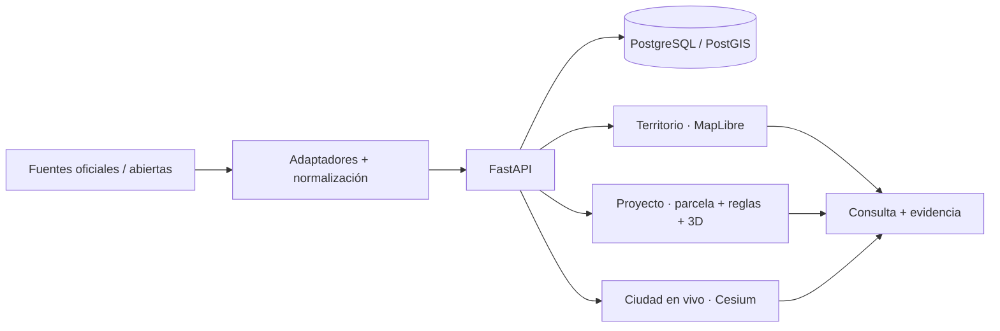

<div align="center">

# 🏙️ SIG Castelldefels · Urban Digital Twin

### Territorio · Proyecto · Ciudad en vivo

Showcase público de un prototipo privado de análisis territorial, proyecto parcelario y ciudad operativa 3D.


[](https://github.com/truquinio/sig-castelldefels-pro-portfolio/actions/workflows/pages.yml)

[**Abrir SIG en Render**](https://sig-castelldefels-twin.onrender.com/) · [**Arquitectura**](docs/ARCHITECTURE.md) · [**Alcance público**](SHOWCASE_SCOPE.md)

**by [Federico Trucco](https://github.com/truinio)** · [LinkedIn](https://www.linkedin.com/in/federico-trucco/)

</div>

---

> [!IMPORTANT]
> Esta es la **edición pública de portfolio**. El SIG operativo se despliega desde un repositorio privado. Aquí se documentan producto, alcance y arquitectura sin publicar el núcleo del backend, reglas internas, automatizaciones ni datasets de trabajo. No es un sistema oficial del Ayuntamiento de Castelldefels ni una fuente normativa.

## 🎯 Qué producto es

El proyecto busca que una persona pueda pasar de **entender un lugar** a **estudiar una parcela** y, cuando existen reglas urbanísticas verificadas, **evaluar su capacidad edificatoria y una propuesta 3D** sin perder la procedencia del dato.

La navegación se reduce deliberadamente a tres mundos:

| Superficie | Para qué sirve |
| --- | --- |
| **Territorio** | SIG de consulta: Catastro, planeamiento, riesgos, ortofoto y contexto |
| **Proyecto** | Parcela → normativa/evidencia → edificabilidad/FAR → ocupación → altura → retranqueos → envolvente/maqueta 3D |
| **Ciudad en vivo** | God’s Eye: movilidad, cámaras, incidencias, vuelos y simulaciones etiquetadas |

La interfaz evita duplicar controles entre esos mundos: cada tarea aparece donde corresponde.

## 🏗️ Flujo para arquitectos y construcción

El núcleo de **Proyecto** está pensado para análisis previo de solares y parcelas:

```text
Seleccionar parcela
→ Catastro
→ planeamiento aplicable
→ afectaciones
→ parámetros urbanísticos verificados
→ edificabilidad / FAR
→ ocupación
→ altura / plantas
→ retranqueos
→ capacidad resultante
→ maqueta / escenario 3D
→ evidencia e informe
```

Si un parámetro no está respaldado por una regla con documento, artículo y vigencia, permanece **sin verificar**. Los valores introducidos manualmente se muestran como **escenario/supuesto**, nunca como normativa.

## 🗺️ Territorio sin saturación

La superficie principal sigue un patrón map-first inspirado en la simplicidad del SIG público de actividades: acciones cartográficas cortas, panel lateral por tarea y sólo el contexto necesario.

Incluye, entre otras funciones:

- selección parcelaria y Catastro;
- MUC / planeamiento como contexto territorial;
- riesgos ACA y otras afectaciones verificables;
- ortofoto ICGC;
- **comparador histórico de ortofotos ICGC** con dos fechas y deslizador;
- edificios/contexto Overture;
- entorno abierto OSM sólo como contexto, no como censo municipal.

## 🌐 Ciudad en vivo / God’s Eye

- aeronaves ADS-B con posición/altitud publicadas y representación 3D;
- buses AMB estimados sobre geometría GTFS, sin presentarlos como GPS si la fuente no publica Vehicle Positions;
- cámaras e incidencias SCT, distinguiendo catálogo, imagen vigente, última imagen válida e indisponibilidad;
- tráfico sintético sólo cuando está rotulado como **simulación visual**;
- iluminación solar y sombras;
- edificios Overture con LoD contextual/procedencia visible.

## 🔎 Procedencia antes que espectáculo

El proyecto mantiene separados:

- **official** — fuente oficial;
- **open** — fuente abierta;
- **derived / estimate** — cálculo o estimación;
- **scenario** — hipótesis para comparar alternativas;
- **synthetic / simulation** — representación generada;
- **unknown** — evidencia insuficiente.

Una escena 3D, una envolvente o un escenario **no sustituyen** licencia, certificado, Catastro ni informe urbanístico.

## ✨ Stack y capacidades

- **MapLibre GL JS** para SIG 2D/2.5D y consulta rápida;
- **CesiumJS** para la escena 3D profunda;
- **FastAPI** para contratos, fuentes y cálculo determinista;
- **PostgreSQL/PostGIS** para geometría, metadatos y reglas versionadas;
- Catastro INSPIRE, ICGC, MUC, ACA, SCT, ICAEN y otras fuentes públicas según disponibilidad;
- OpenStreetMap y Overture como contexto abierto;
- PMTiles / Overture Buildings para ciudad 3D escalable;
- PWA y degradación explícita cuando una fuente externa no responde.

## ▶️ Demo

[**Abrir SIG Castelldefels · Digital Twin en Render**](https://sig-castelldefels-twin.onrender.com/)

El frontend y el backend están separados para mantener la demo gratuita. En el plan free, el backend puede necesitar unos segundos para despertar; la interfaz propia sustituye la pantalla genérica de arranque.

## 🏗️ Arquitectura



📘 [Arquitectura pública](docs/ARCHITECTURE.md)

## 📦 Público vs. privado

| Edición pública | Desarrollo privado |
| --- | --- |
| acceso a la demo real | frontend operativo |
| documentación de producto | API FastAPI |
| arquitectura de alto nivel | PostGIS y contratos |
| principios de procedencia | análisis parcelario / buildability |
| roadmap y límites | reglas versionadas, ingesta y tooling |

El showcase no es un espejo del repositorio privado.

## 🔏 Uso y reutilización

Este repositorio funciona como showcase técnico. **No concede actualmente una licencia open source de reutilización del código.** Las fuentes cartográficas y datos de terceros mantienen sus propias licencias y condiciones.

---

© 2026 Federico Trucco. All rights reserved.  
**by [truquinio](https://github.com/truinio)** · [LinkedIn](https://www.linkedin.com/in/federico-trucco/)