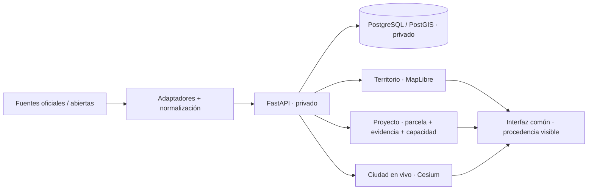

# Arquitectura pública

Este documento describe la arquitectura conceptual de **SIG Castelldefels · Digital Twin** sin publicar el núcleo privado.



## Tres superficies, una sola plataforma

### Territorio

Consulta cartográfica map-first. Catastro, planeamiento, riesgos, ortofoto, comparación temporal y contexto abierto se agrupan por tarea.

### Proyecto

Flujo orientado a arquitectos, técnicos y promotores:

```text
parcela
→ evidencia urbanística
→ edificabilidad / FAR
→ ocupación
→ altura / plantas
→ retranqueos
→ capacidad
→ maqueta o escenario 3D
```

Los parámetros desconocidos siguen siendo desconocidos. Un valor manual es un escenario, no una regla oficial.

### Ciudad en vivo

Cesium concentra movilidad, cámaras, incidencias, vuelos, iluminación y simulaciones. Las estimaciones y elementos sintéticos conservan una etiqueta distinta de los datos observados.

## Separación público / privado

El showcase público contiene documentación, acceso a la demo y arquitectura de alto nivel. El repositorio privado contiene API, adaptadores, reglas, cálculo parcelario, integración de fuentes, pruebas y automatizaciones.

La edición pública se mantiene deliberadamente pequeña para mostrar el producto sin convertirla en un espejo del código privado.
